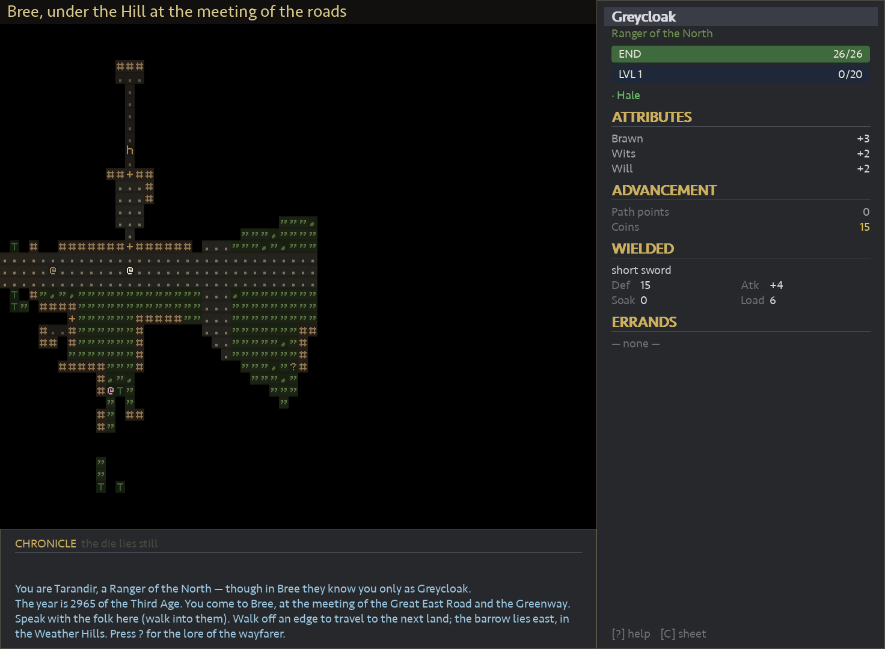
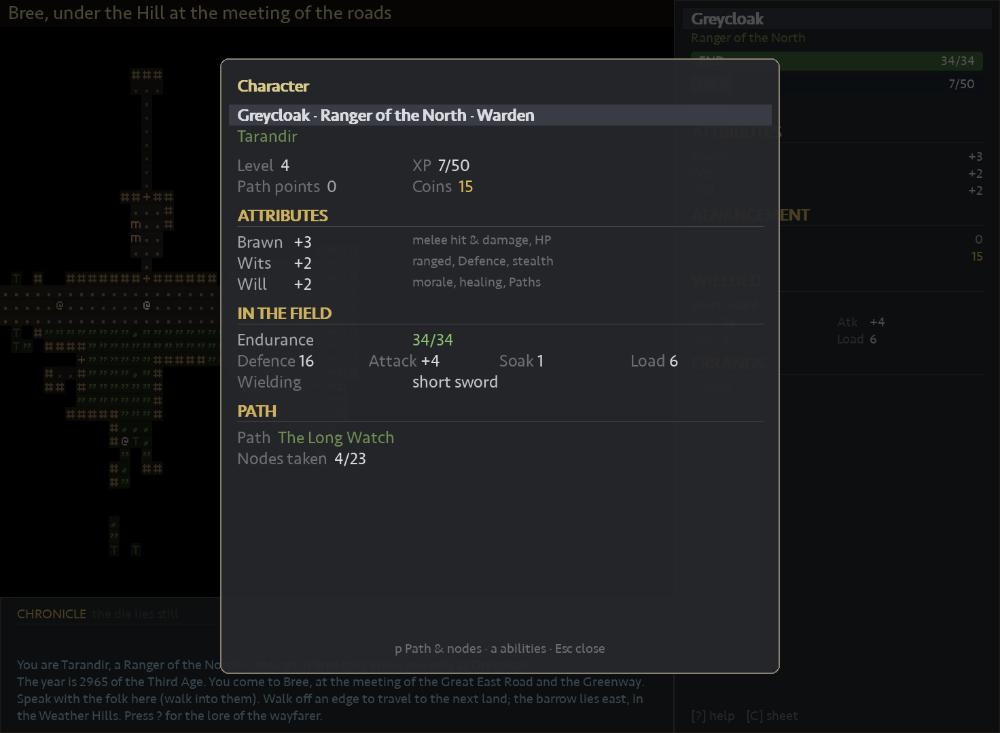

# The Lonelands

> [!NOTE]
> **This is a learning experiment, not a game meant to ship.** The Lonelands is
> really an excuse to drive a real, non-trivial project end-to-end with
> [**Claude Code**](https://claude.com/claude-code) — to see how it plans,
> builds, tests, reviews, and documents an entire codebase over many sessions —
> and to put [**Matt Pocock's Claude agent skills**](https://github.com/mattpocock/skills)
> (issue tracking, triage, domain modelling, code review) to work on an actual
> repo. The roguelike is the vehicle; the *process* is the point. Treat it as a
> sandbox, not a finished product. It is a non-commercial fan project set in
> J.R.R. Tolkien's Middle-earth, and leans on other people's work — see
> [Acknowledgements](#acknowledgements--third-party) for full credits.

A roguelike set in **Eriador in TA 2965**, told with
a lightweight **d20** ruleset of our own (originally adapted from **The One
Ring** TTRPG, since de-coupled — see `docs/adr/0005`).

You play **Tarandir**, a lone **Ranger of the North** whom the Bree-folk call
**Greycloak**, walking out from **Bree** into the Wild — west to the barrow-ruins
of **Tyrn Gorthad** to recover a lost star-brooch of Arnor.

## Screens

**Bree, the hub town** — the ASCII map with the pixel HUD: a sidebar sheet, the
Chronicle log, and the location banner.



**The character sheet** — attributes, in-the-field combat numbers, and the
committed Path.



## Running

```bash
python3 -m pip install -r requirements.txt   # pygame, tcod, numpy
python3 main.py
```

The window, rendering, and input run on **pygame**; **tcod** is retained only as
a headless library for field-of-view and pathfinding (see `docs/adr/0010`). The
game is a classic **ASCII** roguelike (ADR-0015): the map and its creatures are
drawn as coloured glyphs from the bundled **Atkinson Hyperlegible Mono** font,
the same face the map/HUD use; menus and dialogs render natively in a
proportional font.

## What's in this slice

- **A live 15×9 overworld** (see `docs/adr/0002`, `0003`): all 116 walkable
  Regions exist and are enterable, built lazily from the plan-as-data in
  `lonelands/overworld.py` (traced from the Eriador Journey Map). You cross from
  one Region to a neighbour by **walking off its edge**; the **Great Roads** (the
  East Road, the Greenway) stay continuous across every seam. **Bree** `(0,0)` is
  the hub; the **Barrow-downs** `(-1,0)` to the west hold a multi-level barrow
  dungeon (the main quest); **Weathertop** `(2,0)` lies east along the road with
  its own deeps. Most cells are band-tinted placeholder wilds, refined
  cluster-by-cluster.
- **Authored Bree-land content**: beyond Bree's town hub (speaking NPCs, quest-
  givers, and **Halbarad's shop**), the **Hamlets** of **Combe** and **Staddle**
  and the lonely **Forsaken Inn** sit out on the Bree-land cell, and **Archet**
  nestles in the Chetwood — each with its own bystanders, signposts, and errands.
- **Ambient barks**: short, non-interactive flavor lines overheard as you move
  near a **bark source** — *a dog barks somewhere down the Staddle lane*, the
  knock of a tankard from the Forsaken Inn, birdsong at the Chetwood eaves. Each
  source is data (a point, a radius, a pool of lines, a **cadence**) authored
  next to a region's content and throttled per-map so the log stays sparse.
- **Errands with varied objectives**: quests run a small state machine
  (unstarted → active → ready-to-report → done) and advance off game events, not
  just combat. Beyond **slay-N** and **fetch/trigger** goals, the log tracks
  **courier** deliveries (carry a named item to an NPC), **talk-to** goals (seek
  someone out and speak with them), and **travel-to** goals (reach a named
  Region) — each begun and turned in through the same dialog flow.
- **A d20 resolution core** (see `docs/adr/0005`): every action is a **Check** —
  `d20 + attribute (+ node/gear)` vs a **Target Number**. A natural 20 is a
  **Critical** (auto-hit + bonus damage), a natural 1 a **Fumble** (auto-miss);
  **Advantage/Disadvantage** roll two dice and keep the higher/lower. The dice
  tray at the top of the log shows the player's latest roll; the tray owns all
  the numbers, the message log stays pure prose.
- **A committed-skill-tree hero** (see `docs/adr/0011`): three attributes —
  **Brawn**, **Wits**, **Will** — a single **Endurance** HP pool, and XP-driven
  **Level**s that grant HP, to-hit, and **Path points**. At level 2 the Ranger
  **commits to one of three Paths** — the **Long Watch** (tank), the **Far Shot**
  (ranged), or the **Hidden Path** (stealth) — then pours every point down that
  Path's deep, branching tree of **Nodes** (ranked passives, one-and-done
  actives), tipped by two hard-won **capstones**. A future **Kindled Heart**
  Path is deferred.
- **Melee & ranged combat** (see `docs/adr/0006`): melee is a **bump**
  (`d20 + attack bonus vs Defence`, then `weapon damage − soak`); ranged is a
  deliberate aimed **Shot** keyed off Wits, with **bows**, spendable and
  recoverable **arrows**, an **effective range** with fall-off, and **lock-on**
  targeting that cycles through visible foes. Criticals can open **Bleed**; heavy
  armour provides **Soak**.
- **A living economy with procedural loot** (see `docs/adr/0004`): slain foes
  grant **XP** and may drop **loot** — coins into your purse, sellable
  **trade-goods** onto the corpse tile. Gear is generated with **affixes** at
  three rarities — **Plain**, **Fine**, **Rare** — alongside hand-authored named
  **Uniques**; nothing needs identifying. Haul goods back to Halbarad's shop and
  toggle to the **Sell** view (`Tab`) to turn them into coin.
- **A shared chrome visual language** (see `CONTEXT.md` → *The chrome visual
  language*): every panel — the sidebar, character sheet, dialog, menus, and the
  shop — speaks one vocabulary, so highlighting means the same thing everywhere:
  three **luminance tiers** (dim label · normal body · bright glowing value), a
  **filled bar** for the single "this is the thing" emphasis, **header-and-rule**
  section breaks, **stateful colour** used only where hue drives a decision
  (Endurance green→amber→red, spendable Path points in gold), and a **scrim**
  that dims the world behind any open popup.
- **A title-screen difficulty selector**: pick **Merciful**, **Wayfarer**
  (intended balance), or **Grim** — it scales *only the damage the player takes*,
  never enemy Endurance or aim, and rides along in the save.
- **A single-slot save**: pause with `Esc` to save-and-continue or save-and-quit,
  and resume from the title screen's **Continue** option.

## Controls

| Key | Action |
|-----|--------|
| arrows / `hjkl` / `yubn` / numpad | move; into a foe to attack, into a townsperson to talk |
| `.` / `z` | wait |
| `Enter` / `>` / `<` | use the gate / stair / barrow-entrance you stand on |
| `f` | fire a ranged shot (lock-on targeting) |
| `g` | pick up |
| `i` | use / equip from pack |
| `d` | drop |
| `c` | character sheet |
| `p` | Paths & Nodes (spend Path points) |
| `a` | abilities (active Nodes) |
| `q` | errands (quests) |
| `?` | help |
| `Esc` | pause menu — save & continue, save & quit, or quit |

## Layout of the code

```
main.py              entry point + pygame window / event / resize loop
lonelands/
  config.py          screen/layout constants, fonts, difficulties
  fonts.py           pygame glyph atlas: prose + dice faces
  color.py           the palette
  dice.py            the d20 Check engine (Critical / Fumble / Advantage)
  dice_glyphs.py     die-face glyphs for the dice tray
  character.py       attributes, Level curve, the hero's derived stats
  perks.py           the three Paths and their Nodes
  content.py         creatures, weapons, armour, consumables (templates)
  equipment_types.py base-item / slot / property definitions
  affixes.py         the prefix/suffix generator → Plain / Fine / Rare loot
  story/             per-location NPCs, dialog trees & quests (bree, breeland, chetwood)
  quests.py          quest definitions + quest log
  barks.py           ambient proximity-triggered flavor lines (bark sources/fields)
  overworld.py       the 15×9 Region plan-as-data (cells, bands, road edges)
  world.py           the Region grid + travel between Regions and Levels
  procgen.py         Bree / wilderness / barrow generation
  game_map.py        one map's tiles + entities
  entity.py          the base entity + actor plumbing
  engine.py          turn loop, FOV, rendering orchestration
  actions.py         player/actor actions
  input_handlers.py  all game states (main game, dialog, shop, sheet, menus…)
  display.py         pygame window + the Console grid shim + glyph cache
  events.py          input dispatch + KeySym/Modifier shim (SDL keycodes)
  ui.py              pixel-space UI layer for the native menus (panels, text)
  setup_game.py      new-game construction
  savegame.py        single-slot save / load / delete
  components/        fighter, hero, ai, inventory, equipment, equippable, consumable, npc
  tile_types.py      numpy tiles with lit / remembered graphics
  render_order.py    entity draw ordering
  render_functions.py the sidebar, banners, bars
  message_log.py     the scrolling Chronicle
```

## Designed to grow

This is a deliberately small, fully-wired vertical slice. Natural next steps:
the Journey/Travel minigame, Fellowship-phase downtime, more of Eriador (the
wider Barrow-downs, Rivendell), and Shadow & Corruption.

## Acknowledgements & third-party

Almost none of the foundations here are original — this project stands on other
people's work, and this section notes what belongs to whom.

**Tooling & process**
- [**Claude Code**](https://claude.com/claude-code) (Anthropic) — the agent this
  whole experiment is built to exercise; nearly all the code was written with it.
- [**Matt Pocock's Claude agent skills**](https://github.com/mattpocock/skills) —
  the issue-tracker, triage-label, domain-modelling, and code-review workflows
  this repo uses (see `docs/agents/`, `CLAUDE.md`). Adapted, not authored, here.

**Libraries** (installed via `requirements.txt`, not vendored)
- [**pygame**](https://www.pygame.org/) — windowing, rendering, input, glyph
  rasterisation (LGPL).
- [**python-tcod**](https://github.com/libtcod/python-tcod) — field-of-view and
  pathfinding, kept headless (BSD).
- [**NumPy**](https://numpy.org/) — the tile arrays (BSD).

**Assets**
- **Atkinson Hyperlegible Mono** — the bundled map/HUD font
  (`lonelands/assets/fonts/`), © 2020–2024 The Atkinson Hyperlegible Mono Project
  Authors (Braille Institute of America), used under the **SIL Open Font License
  1.1** (see the bundled `OFL.txt`). The native menus otherwise fall back to your
  system's fonts via pygame.

**Setting & rules**
- **Middle-earth, Eriador, and the Third Age** are the creation of **J.R.R.
  Tolkien** (and the Tolkien Estate). This is an unofficial, non-commercial fan
  work; no affiliation or endorsement is implied.
- The d20 ruleset was **originally adapted from _The One Ring_** TTRPG
  (Free League Publishing) and has since been de-coupled into its own system —
  see `docs/adr/0005`.

Everything else — the world data, content, quests, and the game code itself — was
written for this project (with Claude Code).
