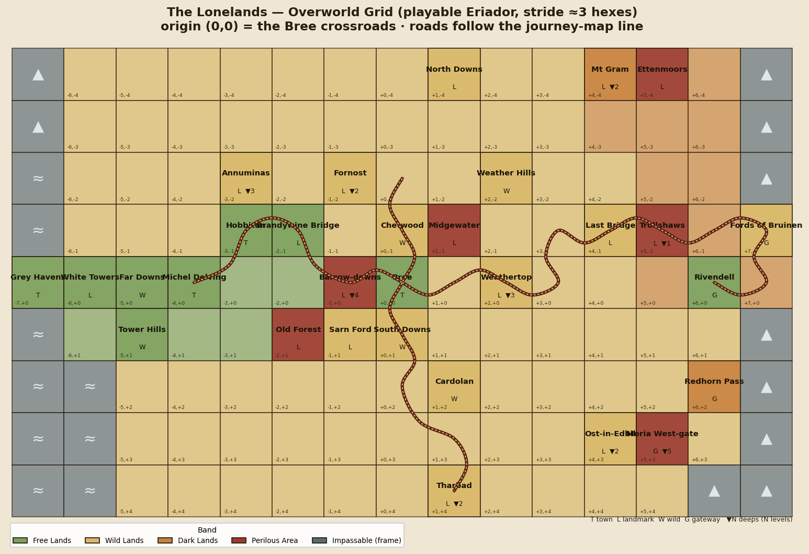

# The Lonelands — Overworld Map Plan

A plan for building the whole walkable overworld as a grid of **Regions**
(see `CONTEXT.md` → *World & navigation* and ADR 0002), traced one-to-one from
the TOR **Eriador Journey Map** (`references/eriador-journey-map.jpeg`).

This is a **design plan, not code** — it decides *what is where* so the
`GameWorld` region-grid (`lonelands/world.py`) can later be filled out from it.
Every cell here is editable: nudge a coordinate, change a band, and re-run
`scripts`-side generation later.

---

## How to read the two maps

**Overlay** — the plan drawn straight over Tolkien's map, to prove the trace is
faithful (Bree lands on Bree, Weathertop on Amon Sûl, Moria at the mountain
wall):

**Schematic** — the distilled working surface: the 15×9 grid, band-coloured,
each cell labelled with name · role · deeps · roads. This is the one to design
against day to day:

---

## The model (decisions behind this plan)

- **Hybrid grid.** Named **anchor** Regions (towns, landmarks, gateways) with
  **wilderness** filler between them — a continuous walkable field, *not* one
  Region per map-hex.
- **Square, 4-neighbour** lattice, matching the engine exactly
  (`cross_edge` carries the player N/E/S/W only). Diagonal map features
  staircase into orthogonal steps.
- **Playable-Eriador window.** Blue Mountains → Misty Mountains,
  North Downs/Ettenmoors → Tharbad/Enedwaith. The Sea and the mountains are the
  frame, not authored cells.
- **Stride ≈ 3 map-hexes per Region → a 15 × 9 grid** (135 cells).
- **Origin `(0,0)` = the window's geographic centre = the Bree crossroads.**
  Bree is *not* forced to the origin; it lands there because it genuinely is the
  hub of Eriador's road-net — the **East Road** runs along **row `y = 0`** and
  the **Greenway** runs down **column `x = 0`**, crossing at Bree.

### Coordinates

`x` runs **−7 (west) … +7 (east)**, `y` runs **−4 (north) … +4 (south)**,
y-down to match screen/engine convention. Bree is `(0,0)`; the current
in-code plus (Bree, Weather Hills, Barrow-downs, Chetwood, South Downs) all sit
in the centre of this grid.

---

## Legend

### Role — what is authored in a cell
| Mark | Role | Meaning |
|---|---|---|
| `T` | **Town** | Settlement with NPCs, services, a central Square. |
| `L` | **Landmark** | A named non-town place with something to find/do; often has deeps. |
| `W` | **Wilderness** | Un-named filler; procgen terrain + random encounters, no fixed content. |
| `G` | **Gateway** | A Region at the world-wall pointing *beyond* the window — "here, later." |
| `X` | **Impassable** | Not a real Region — the *absence* of one (see below). |

### Band — danger/terrain, traced from the map's legend colours
| Colour | Band | Drives |
|---|---|---|
| 🟩 Green | **Free Lands** | Safe encounter table, settled tone. |
| 🟨 Tan | **Wild Lands** | Standard wilderness table. |
| 🟧 Orange | **Dark Lands** | Nasty table; servants of the Enemy. |
| 🟥 Red | **Perilous Area** | Set-piece danger (the map's numbered hexes). |

### Roads — edge metadata
Each border between two Regions is **road / track / trackless**. Crossing on a
road is safer/faster and lands you on the road tile in the next Region; leaving
the Road bumps the encounter band meaner. Roads follow the **journey-map line**,
not straight axes — they meander across rows the way the drawn map does. The
plan threads three:

- **Great East Road** — `(0,0)` Bree → Weathertop `(2,0)`, then bows **north**
  to Last Bridge `(4,-1)` → Trollshaws `(5,-1)` → the Fords of Bruinen `(7,-1)`,
  and hooks back **south** across the ford to Rivendell `(6,0)`.
- **Greenway / North–South Road** — Fornost `(0,-2)` → Bree → Sarn Ford →
  Tharbad `(1,+4)` (column `x = 0`, bending south-east to Tharbad).
- **Shire Road** — Michel Delving `(-4,0)` → Hobbiton → Brandywine Bridge →
  Bree.

Both maps render the roads as smooth bowed **Catmull-Rom splines** so they read
as roads, not polylines.

### Deeps — the vertical axis
`▼N` marks a cell whose Surface has a down-stair into **N Levels** of deeps
(dungeon). This plan only marks *which cells have a door and roughly how deep* —
it designs no dungeon levels.

### Impassable — absence, with a diegetic border
Impassable cells (Sea, Misty Mountains) are simply **not in the grid**;
`region(coord)` returns `None` and that edge reports as uncrossable — no new
machinery (ADR 0002). The **Region bordering** such an edge paints the barrier
*in-world* — a ridge of mountains, a cliff, open water along that edge — so the
block reads diegetically, never as an invisible wall. Real crossings in the wall
(Fords of Bruinen, Moria gate, Redhorn Pass) are **Gateway** Regions, not walls.

---

## Anchor Regions

Cells not listed below are **Wilderness** of the surrounding band (or the
**Impassable** Sea/Mountain frame). Ordered north→south, west→east.

| Coord | Name | Role | Band | Deeps | Road | Notes |
|---|---|---|---|---|---|---|
| `+1,-4` | North Downs | Landmark | Wild | – | – | Rolling high downs; the road to the ruined north. |
| `+4,-4` | Mt Gram | Landmark | Dark | ▼2 | – | Orc-hold of the northern hills; deeps into the goblin-warren. |
| `+5,-4` | Ettenmoors | Landmark | Perilous | – | – | Troll-fells; north-east gateway toward Angmar. |
| `-3,-2` | Annúminas | Landmark | Wild | ▼3 | – | Ruined royal city on Lake Nenuial; deeps into the drowned halls. |
| `-1,-2` | Fornost | Landmark | Wild | ▼2 | – | Norbury of the Kings; ruined Arnor capital, wight-haunted deeps. |
| `+2,-2` | Weather Hills | Wilderness | Wild | – | – | The ridge-line running north from Weathertop. |
| `-3,-1` | Hobbiton | Town | Free | – | – | Hobbit hamlet; the Hill and Bag End. |
| `-2,-1` | Brandywine Bridge | Landmark | Free | – | yes | Stone bridge; the Shire's eastern gate onto the Road. |
| `+0,-1` | Chetwood | Wilderness | Wild | – | yes | Wooded country north of Bree. |
| `+1,-1` | Midgewater | Landmark | Perilous | – | – | Midgewater Marshes; biting fen, easy to lose the Road. |
| `+4,-1` | Last Bridge | Landmark | Wild | – | – | The Mitheithel bridge on the East Road; the Road's last sure crossing. |
| `+5,-1` | Trollshaws | Landmark | Perilous | ▼1 | – | Troll-country east of the Hoarwell; stone-trolls and their holes. |
| `+7,-1` | Fords of Bruinen | Gateway | Wild | – | – | The Bruinen crossing; the guarded threshold of Rivendell. |
| `-7,+0` | Grey Havens | Town | Free | – | – | Mithlond; elven port. Western gateway (ships west, later). |
| `-6,+0` | White Towers | Landmark | Free | – | – | Elostirion; the palantír that looks only to the Sea. |
| `-5,+0` | Far Downs | Wilderness | Free | – | – | The Shire's western downs. |
| `-4,+0` | Michel Delving | Town | Free | – | yes | Chief town of the Shire; the Mathom-house. |
| `-1,+0` | Barrow-downs | Landmark | Perilous | ▼4 | – | Tyrn Gorthad; the barrow-wights and their deeps. |
| `+0,+0` | **Bree** | Town | Free | ▼ | yes | The hub, at the meeting of the roads; a Ranger is met here. |
| `+2,+0` | Weathertop | Landmark | Wild | ▼3 | yes | Amon Sûl; ruined watchtower, deeps to the watch-chamber. |
| `+6,+0` | Rivendell | Gateway | Free | – | – | Imladris; the Last Homely House. Eastern gateway (beyond, later). |
| `-5,+1` | Tower Hills | Wilderness | Free | – | – | Emyn Beraid; green marches west of the Far Downs. |
| `-2,+1` | Old Forest | Landmark | Perilous | – | – | Ancient wood; the trees are awake and ill-disposed. |
| `-1,+1` | Sarn Ford | Landmark | Wild | – | yes | The Brandywine ford; a Ranger watch-post on the south road. |
| `+0,+1` | South Downs | Wilderness | Wild | – | yes | Low downs south of the Great Road. |
| `+1,+2` | Cardolan | Wilderness | Wild | – | – | Emptied old realm; barrows and broken keeps. |
| `+6,+2` | Redhorn Pass | Gateway | Dark | – | – | Caradhras pass over the Misty Mountains (beyond, later). |
| `+4,+3` | Ost-in-Edhil | Landmark | Wild | ▼2 | – | Ruined Eregion city of the Elven-smiths; cellars and forges. |
| `+5,+3` | Moria West-gate | Gateway | Perilous | ▼5 | – | Hollin gate of Khazad-dûm; the Watcher and the long dark. |
| `+1,+4` | Tharbad | Landmark | Wild | ▼2 | yes | Ruined river-city on the Greyflood; southern gateway. Silted deeps. |

> **Note on Bree's deeps:** the in-code plus currently hangs the barrow's deeps
> off the **Weather Hills** Region; in this plan the barrow deeps belong to the
> **Barrow-downs** `(-1,0)` cell (Tyrn Gorthad), and Weathertop `(2,0)` carries
> the Amon Sûl deeps. That's a deliberate re-home to match geography — flag if
> you'd rather keep the current wiring.

---

## Known first-draft rough edges (nudge these)

- **Stride-3 collisions.** A few anchors that are <3 hexes apart on the sheet
  got bumped one cell to avoid sharing a square (e.g. Old Forest vs
  Barrow-downs). Check the overlay and move any that read wrong.
- **The East Road's east end** hooks: it crosses the ford at `(7,-1)` and
  doubles back south-west to Rivendell `(6,0)`, matching the map (Rivendell sits
  in the gorge below/beside the ford). If you'd rather a straight run-in, move
  Rivendell to `(7,0)` and drop the hook.
- **Band edges are coarse.** Un-authored cells got a band by a broad
  geography rule (green Shire/Arthedain box, orange NE, tan elsewhere). The
  legend-colour boundaries on the real map are wobblier — refine per cell as you
  author.
- **Gateways beyond the window.** Rivendell, Redhorn, Moria, Grey Havens, and
  the Bruinen ford are marked as gateways to content that sits *outside* the
  playable window; they're thresholds, not full Regions yet.

## Next steps (when this moves to code)

1. Replace `world.py::_region_defs` hard-coded plus with this grid, keyed by the
   coords above (Bree stays the `new_game` start at `(0,0)`).
2. Give each **band** a procgen encounter table; each **road** cell a road tile
   the arrival logic snaps to.
3. Teach the bordering-Region generators the **diegetic-border rule** (paint
   mountains/water on edges with no neighbour).
4. Author the **deeps** marked `▼N` as their own pass, Region by Region.
